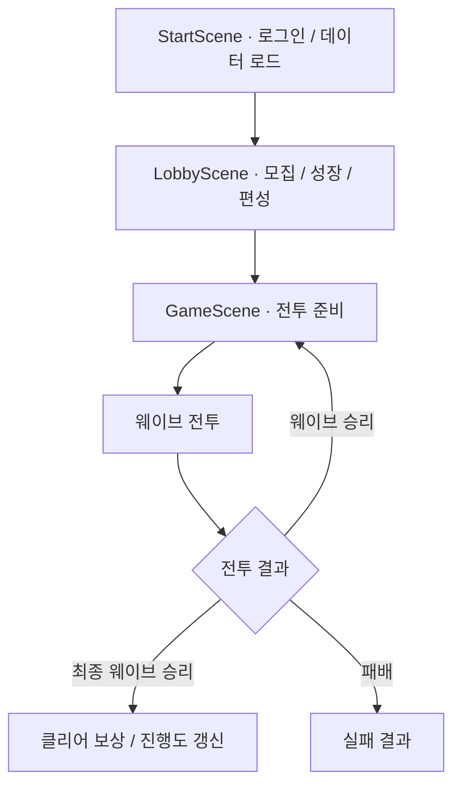

# Defenders

**유닛을 모집하고 성장시켜 몬스터 웨이브에 도전하는 Unity 2D 디펜스 RPG**

<p>
  
  
  
  
</p>

## 프로젝트 소개

Defenders는 유닛 수집·육성과 웨이브 기반 자동 전투를 결합한 게임 프로젝트입니다.

로비에서 전투에 사용할 유닛을 편성하고, 스테이지에서는 편성한 유닛 중 하나를 무작위로 소환합니다. 준비 단계에서 유닛을 배치하고 합성해 전력을 구성한 뒤, 전투 단계에서 몬스터 웨이브를 상대합니다.

전투 시스템뿐 아니라 모집, 성장, 인벤토리, 우편함, 사용자 데이터 저장, 보상형 광고 등 로비와 전투를 연결하는 시스템을 함께 구현하고 있습니다.

| 항목 | 내용 |
| --- | --- |
| 장르 | 2D 디펜스 RPG |
| 엔진 | Unity 6 · `6000.3.7f1` |
| 언어 | C# |
| 그래픽 | 2D 스프라이트 · Tilemap · URP |
| 외부 서비스 | Firebase Authentication · Cloud Firestore · Google AdMob |
| 개발자 | [김민우 · K1M-MinW00](https://github.com/K1M-MinW00) |

## 게임 진행

1. **접속** — Firebase 초기화와 익명 로그인 후 사용자 데이터를 불러오거나 생성합니다.
2. **로비** — 유닛을 모집·성장시키고 전투에 사용할 유닛을 편성합니다.
3. **전투 준비** — 유닛을 소환·배치하고, 같은 유닛을 합성해 성급을 높입니다.
4. **웨이브 전투** — 유닛과 몬스터가 대상을 탐색하고 이동·공격·스킬을 수행합니다.
5. **결과 처리** — 웨이브 보상을 획득하고, 스테이지를 클리어하면 진행도를 갱신합니다.



## 주요 기능

### 전투 및 스테이지

- **준비·전투 단계 분리** — 준비 타이머, 웨이브 시작, 승패 판정과 결과 UI를 단계별로 처리합니다.
- **무작위 소환과 배치** — 로비에서 선택한 유닛을 소환 대상으로 사용하고, Tilemap 기반 배치 영역을 확인합니다.
- **자동 합성** — 준비 단계에서 종류와 성급이 같은 유닛 2개를 합성하며, 연쇄 합성과 최대 4성까지의 성급 상승을 지원합니다.
- **자동 전투 AI** — 유닛과 몬스터의 행동을 FSM으로 관리하고, NavMesh 기반 이동과 근접·원거리 공격을 처리합니다.
- **유닛별 스킬** — 11종의 유닛 데이터와 유닛별 액티브·패시브 스킬 클래스를 구성합니다. 액티브 스킬은 전투 중 3성 이상, 에너지 충족 등의 조건을 검사해 실행합니다.
- **전투 UI** — 웨이브 진행, 체력 요약, 피해량 표시, 일시 정지와 결과 화면을 제공합니다.

### 로비 및 성장

- **유닛 모집** — 일반·특별 모집, 1회·10회 모집, 등급별 확률과 전설 확정 획득 카운트를 관리합니다.
- **모집 비용 계산** — 모집권을 우선 사용하고 부족한 수량은 보석으로 계산합니다.
- **영구 성장** — 훈련, 승급, 한계돌파를 위한 시스템과 UI를 구성하고, 레벨·승급·한계돌파 효과를 능력치 계산에 반영합니다.
- **중복 획득 처리** — 중복 유닛을 한계돌파 재료로 누적하고, 수령 한도를 넘긴 중복 획득은 등급에 따른 보석 보상으로 전환합니다.
- **인벤토리·우편함** — 아이템을 관리하고, 우편 보상 수령·일괄 수령·수령한 우편 삭제·만료 처리를 지원합니다.

### 데이터 및 외부 서비스

- **Firebase Authentication** — 익명 로그인과 기존 로그인 세션 유효성 검사를 처리합니다.
- **Cloud Firestore** — 프로필, 재화, 보유 유닛, 인벤토리, 모집 카운트와 진행도를 저장합니다.
- **연료 회복** — 마지막 갱신 시각과 현재 시각의 차이로 300초당 연료 1을 회복하고, 다음·최대 회복까지 남은 시간을 표시합니다.
- **Google AdMob** — 보상형 광고를 미리 로드하고, 보상 획득 콜백을 받은 뒤 광고가 닫히면 연료 보상을 지급합니다. 이후 다음 광고를 다시 로드합니다.

> 스테이지에서 올리는 **성급**과 로비에서 진행하는 **승급·한계돌파**는 별도로 관리합니다. 성급은 해당 전투의 성장 요소이며, 로비 성장 정보는 사용자 데이터에 저장됩니다.

## 핵심 설계

### 1. 스테이지 흐름과 초기화 책임 분리

`StageSessionController`가 준비·전투·클리어·실패 상태를 관리합니다. 맵 생성과 배치 영역, 소환 위치, 카메라 범위의 초기화는 `StageBootstrapper`에서 처리합니다.

보상 지급과 진행도 갱신도 별도 서비스로 분리해, 전투 흐름을 읽는 코드에서 각 단계의 역할을 확인할 수 있도록 구성했습니다.

**관련 코드:** [StageSessionController](Assets/Scripts/Features/Stage/Controllers/StageSessionController.cs) · [StageBootstrapper](Assets/Scripts/Core/Bootstrap/StageBootstrapper.cs)

### 2. 기준 데이터 · 사용자 성장 · 전투 상태 분리

| 구분 | 대표 데이터 | 역할 |
| --- | --- | --- |
| 기준 데이터 | `UnitDataSO`, `MonsterDataSO`, `StageDataSO`, `GachaDataSO` | 유닛 능력치, 몬스터, 웨이브, 모집 확률 등 콘텐츠 설정 |
| 사용자 데이터 | `UserDataRoot`, `UserUnitData` | 재화, 보유 유닛, 레벨, 승급, 한계돌파 등 저장 정보 |
| 전투 데이터 | `StageUnitRuntime` | 현재 성급과 전투에 적용할 기준·최종 능력치 |

`UnitStatCalculator`에서 사용자 성장에 따른 능력치를 계산하고, `StageUnitRuntime`에서 스테이지의 성급과 능력치를 관리합니다.

**관련 코드:** [UnitStatCalculator](Assets/Scripts/Features/Units/Combat/UnitStatCalculator.cs) · [StageUnitRuntime](Assets/Scripts/Features/Units/Runtime/StageUnitRuntime.cs) · [Data](Assets/Scripts/Data)

### 3. FSM과 공격·스킬 동작 분리

유닛은 대기·이동·공격·스킬·사망 상태를, 몬스터는 대기·이동·공격 상태를 구분합니다. 공격 동작은 `IUnitAttack`, `IMonsterAttack` 인터페이스와 개별 구현 클래스로 구성합니다.

스킬은 `ActiveSkillBase`, `PassiveSkillBase`를 기반으로 확장합니다. `UnitSkillController`는 사용 조건, 대상 확보 실패 정책, 애니메이션과 연결되는 실행 단계, 전투 이벤트에 따른 패시브 호출을 관리합니다.

**관련 코드:** [유닛 FSM](Assets/Scripts/Features/Units/FSM) · [몬스터 FSM](Assets/Scripts/Features/Monsters/FSM) · [UnitSkillController](Assets/Scripts/Features/Units/Skills/UnitSkillController.cs)

### 4. 전투 오브젝트 풀과 웨이브 사전 생성

`StagePoolManager`에서 프리팹별 풀을 관리하고, 몬스터·투사체·이펙트·UI 카테고리로 생성 위치를 구분합니다. 웨이브 준비 단계에서는 `MonsterPrewarmService`로 몬스터를 미리 준비합니다.

반복 생성되는 전투 오브젝트를 재사용할 수 있도록 구성했으며, `IPoolable`을 통해 생성·반환 시 필요한 상태 처리를 정의합니다.

**관련 코드:** [StagePoolManager](Assets/Scripts/Features/Stage/Runtime/StagePoolManager.cs) · [MonsterPrewarmService](Assets/Scripts/Features/Monsters/Spawn/MonsterPrewarmService.cs) · [Pooling](Assets/Scripts/Core/Pooling)

### 5. 사용자 데이터와 기능별 서비스

`UserDataManager`가 사용자 데이터의 로드·생성·저장을 담당하고, 재화·인벤토리·모집·보상·보유 유닛·우편 처리를 서비스별로 나눕니다.

변경 여부는 `MarkDirty()`로 기록하며, 프로필·재화·진행도 변경 이벤트를 통해 관련 UI를 갱신합니다. 인증과 사용자 데이터처럼 씬을 넘어 유지해야 하는 객체에는 `DontDestroyOnLoad`를 적용합니다.

**관련 코드:** [UserDataManager](Assets/Scripts/Services/User/UserDataManager.cs) · [GachaService](Assets/Scripts/Services/Gacha/GachaService.cs) · [RosterService](Assets/Scripts/Services/User/RosterService.cs)

## 기술 스택

| 기술 | 사용 목적 |
| --- | --- |
| Unity 6 / C# | 게임 로직, 씬 구성, UI 구현 |
| Universal Render Pipeline | 2D 렌더링 |
| Tilemap | 맵 구성 및 유닛 배치 영역 |
| NavMeshPlus / AI Navigation | 2D 환경의 경로 탐색과 이동 |
| Input System | 입력 처리 |
| uGUI / TextMesh Pro | 로비·전투 UI와 텍스트 표시 |
| ScriptableObject | 콘텐츠 기준 데이터 관리 |
| Firebase Authentication | 사용자 인증 |
| Cloud Firestore | 사용자 데이터 및 우편 저장 |
| Google Mobile Ads SDK | 보상형 광고 연동 |

## 코드 탐색

| 경로 | 주요 내용 |
| --- | --- |
| [Core](Assets/Scripts/Core) | 초기화, 카메라, 인터페이스, 오브젝트 풀 |
| [Data](Assets/Scripts/Data) | 유닛·몬스터·스테이지·아이템·사용자 데이터 |
| [Features/Startup](Assets/Scripts/Features/Startup) | 시작 로딩과 로그인 흐름 |
| [Features/Lobby](Assets/Scripts/Features/Lobby) | 로비, 모집, 상점, 프로필 UI |
| [Features/Stage](Assets/Scripts/Features/Stage) | 스테이지 상태, 웨이브, 보상과 진행도 |
| [Features/Units](Assets/Scripts/Features/Units) | 유닛 전투, FSM, 스킬, 투사체 |
| [Features/Monsters](Assets/Scripts/Features/Monsters) | 몬스터 AI와 스폰 |
| [Features/Placement](Assets/Scripts/Features/Placement) | 유닛 드래그와 배치 |
| [Services](Assets/Scripts/Services) | 인증, 재화, 모집, 합성, 인벤토리, 우편 |
| [System](Assets/Scripts/System) | 광고, 유닛 목록과 초기화 |
| [UI](Assets/Scripts/UI) | 성장 패널, 전투 결과 등 UI 구성 |
| [Resources](Assets/Resources) | 런타임에 불러오는 데이터 에셋 |

## 실행 방법

1. 저장소를 내려받습니다.

   ```bash
   git clone https://github.com/K1M-MinW00/Defenders.git
   ```

2. Unity Hub에서 프로젝트를 추가하고 **Unity 6000.3.7f1**로 엽니다.
3. 패키지와 에셋 임포트가 완료될 때까지 기다립니다. NavMeshPlus는 Git URL 의존성이므로 Git이 설치되어 있어야 합니다.
4. Firebase Authentication의 익명 로그인과 Firestore에 접근할 수 있는 개발 환경을 준비합니다. 독립적으로 실행할 경우 본인의 Firebase 프로젝트에 맞는 설정 파일과 접근 규칙을 구성합니다.
5. `Assets/Scenes/StartScene.unity`를 열고 실행합니다.
6. 초기화와 데이터 로드가 완료되면 시작 버튼으로 로비에 진입합니다.

| 씬 | 역할 |
| --- | --- |
| `StartScene` | 데이터베이스 초기화, 로그인, 사용자 데이터 로드 |
| `LobbyScene` | 유닛 관리, 모집, 전투 진입 |
| `GameScene` | 스테이지 초기화와 웨이브 전투 |

`GameScene`은 로비에서 전달하는 `StageEnterData`를 사용하므로, 기본 실행 흐름은 `StartScene`부터 시작합니다.

Android에서 광고를 확인하려면 Android Build Support와 SDK·NDK·JDK, Google Mobile Ads 설정이 필요합니다. 현재 `AdManager`는 Android 보상형 광고 테스트 ID를 사용합니다.

## 구현 범위 참고

- 이 문서는 현재 저장소의 코드와 설정을 기준으로 작성했습니다.
- 장비 데이터 구조는 존재하지만, `UnitStatCalculator`의 장비 효과 적용은 아직 연결되지 않았습니다.
- 현재 보상형 광고 코드는 연료 보상 연동을 포함하며, 일일 시청 횟수 제한은 포함하지 않습니다.
- 연료 회복 시각은 기기의 UTC 시각을 기준으로 계산합니다.
- 실행에는 Firebase 등 외부 서비스 설정이 필요하며, 위 설명은 빌드·실기기 동작 검증을 대신하지 않습니다.
